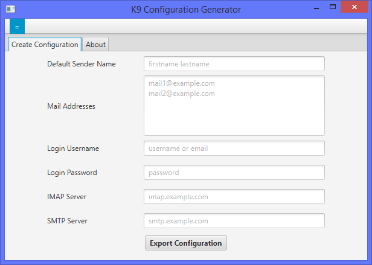

# K9 Configuration Generator

Generates a K9 Mail Configuration File including the password so you can fill in the settings on the computer.
Transfer the config file via a secure channel to you android device, import it and delete it afterwards.

## Features
- Multiple E-Mail-Addresses for the single account
- Password in the config file (no need to enter anything on the android)

## Missing
- Multiple E-Mail-Accounts
- Multiple E-Mail-Names

